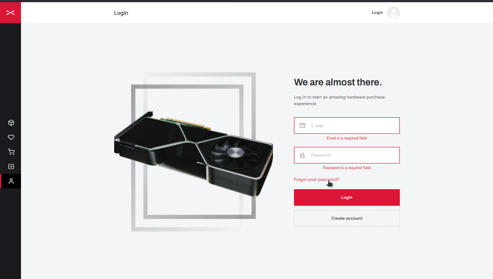

<h1 align="center" title="PcX">
		
		PcX
</h1>

<h2 align="center">Pcx is a marketplace for buying and selling used hardware!</h2>

<h4 align="center">
 <a href="#-features">💻 Features</a> •
 <a href="#-technologies-used">🛠 Technologies</a> •
 <a href="#books-what-i-learn">:books: What I learn</a>
 <a href="#-how-to-run-the-project">🔨 How to run the project</a> •
 <a href="#️-authors">✒️ Authors</a>
</h4>

<br>



<h2 align="center">
	<a href="https://pcx.lucasestevam.tech">View Demo</a>
</h2>

<h2 align="center">🚧 Project still under development</h2>

## 💻 Features

| Feature                  | Coded? | Description                                                                              |
| ------------------------ | ------ | ---------------------------------------------------------------------------------------- |
| Home screen              | ❌     | -                                                                                        |
| Header Component         | ✔      | Reusable header component.                                                               |
| Sidebar Component        | ✔      | Reusable sidebar component.                                                              |
| Input Component          | ✔      | Reusable input component with options for left and right icons, masks and custom labels. |
| Signin screen            | ✔      | Signin screen with react hook form and yup for input validation.                         |
| Recovery password screen | ✔      | Recovery password screen with react hook form and yup for input validation.              |
| Signup screen            | ✔      | Signup screen with react hook form and yup for input validation.                         |
| Modal Hook               | ✔      | Custom modal hook with "success" and "error" options.                                    |
| Products list screen     | ❌     | -                                                                                        |
| Filter Modal             | ❌     | -                                                                                        |
| Product screen           | ❌     | -                                                                                        |
| Favorites screen         | ❌     | -                                                                                        |
| Checkout screen          | ❌     | -                                                                                        |
| Create product screen    | ❌     | -                                                                                        |
| Edit product screen      | ❌     | -                                                                                        |

## 🛠 Technologies Used

- [React](https://reactjs.org/)
- [TypeScript](https://www.typescriptlang.org/)
- [Next.js](https://nextjs.org)
- [Chakra UI](https://chakra-ui.com)
- [React Icons](https://react-icons.github.io/react-icons/)
- [React Hook Form](https://react-hook-form.com)
- [Yup](https://www.npmjs.com/package/yup)
- [Axios](https://axios-http.com/docs/intro)
- [Nookies](https://www.npmjs.com/package/nookies)
- [ESLint](https://prettier.io)
- [Prettier](https://eslint.org)
- [Editor Config](https://editorconfig.org)

## :books: What I learn

- [x] How validate and manipulate inputs with react hook form and yup.

## 🔨 How to run the project

For this project to work 100%, you will also need to run the back end, for that [check this repository](https://github.com/HeitorFranco/hardwares_backend).

In addition, you must configure the environment variables as described in the `.env.example` file.

```bash
# Clone this repository
$ git clone https://github.com/tl-lucasestevam/pcx.git

# Access the project folder
$ cd pcx

# Install the dependencies
$ yarn

# Run the application in development mode
$ yarn dev

```

## **✒️ Authors**

<div align=center>
  <table style="width:100%">
    <tr align=center>
      <td>
        <a href="https://github.com/tl-lucasestevam">
          
        </a>
        <p>
          Lucas Estevam <br/>
          (Front-end)
        </p>
      </td>
      <td>
        <a href="https://github.com/HeitorFranco">
          
        </a>
        <p>
          Heitor Franco <br/>
          (Back-end)
        </p>
      </td>
    </tr>
  </table>
</div>
